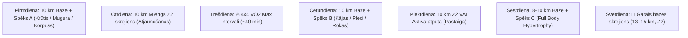

# Treniņu, Uztura un Hidratācijas Rekomendācijas & Nedēļas Programma

**Datums:** 2026. gada 9. septembris  
**Fokuss:** Rekompozīcija (*Tauku dedzināšana, muskuļu pieaugums +1.5 kg, VO2 Max celšana uz 52–55 ml/kg/min, Fitness Age 30 gadi*).

---

## 📊 1. Garmin Pēdējo Dienu Kaloriju & Slodzes Dati

| Datums | Kopējās kcal | Aktīvās kcal | BMR kcal | Soļi / Distance | Galvenās aktivitātes |
| :--- | :---: | :---: | :---: | :---: | :--- |
| **06.09.** (Sv.) | **3 846** | 1 793 | 2 053 | 34 505 (~31.3 km) | Skrējiens 14.36 km (1 075 kcal) |
| **07.09.** (P.) | **3 078** | 1 022 | 2 056 | 19 017 (~17.0 km) | Bāzes skrējiens 10.47 km (819 kcal) |
| **08.09.** (O.) | **3 705** | 1 656 | 2 049 | 21 011 (~18.9 km) | Skrējiens 10.30 km (803 kcal) + Spēks (551 kcal) |
| **09.09.** (T.) | *1 570* | *729* | *841* | *11 210 (~11.0 km)* | Rīta skrējiens 10.12 km (788 kcal) *(līdz 12:00)* |

* **3 pilno dienu vidējais patēriņš:** **~3 543 kcal / dienā** (no tām ~1 490 kcal aktīvās).

---

## 🥤 2. Zero Dzērieni (Coca-Cola Zero / Pepsi Zero)

### Zinātniskais un praktiskais vērtējums:
* **Kaloriju deficīts:** Satur 0 kcal, **neizjauc kaloriju deficītu** un neaptur tauku dedzināšanu (neizraisa insulīna lēcienu).
* **Drošība un saldinātāji:** PVO un EFSA noteiktā drošā dienas deva (ADI) aspartāmam ir 40–50 mg/kg (~4–5 litri dienā pie 81 kg svara). 1–2 glāzes vai viena bundža ir pilnīgi droša.
* **Riski, kam jāpievērš uzmanība:**
  1. **Zobu emalja:** Fosforskābe un citronskābe rada zemu pH (~2.5–3.0). Vēlams izdzert reizē ar ēdienu vai uzreiz, nevis malkot visas dienas garumā.
  2. **Kofeīns un miegs:** 2L pudele satur >200 mg kofeīna. Dzert tikai pirmajā dienas pusē (līdz 14:00–15:00).
  3. **Gremošana:** Gāzēts dzēriens + augsts šķiedrvielu daudzums uzturā (65g) var pastiprināt vēdera pūšanos.

---

## 💧 3. Ūdens & Elektrolītu Protokols

### A. Dienas ūdens norma: **2.5 līdz 3.5 litri tīra ūdens**
* **Kāpēc tik daudz:** 10–14 km ikdienas skrējieni, liels olbaltumvielu daudzums (220–250 g), augsts šķiedrvielu daudzums (60–65 g) un 10 g kreatīna prasa paaugstinātu šķidruma daudzumu nierēm un šūnām.

### B. Mājās gatavots elektrolītu dzēriens:
Kad stipri svīsti, **~90% no zaudētajiem minerāliem ir NĀTRIJS (sāls)**. Citronu sula (piem., *Limmi*) ir lieliska garšas, kālija un C vitamīna bāze, bet tai obligāti jāpievieno sāls:

```
🧪 Elektrolītu formula:
• 500–700 ml tīrs ūdens
• 1–2 ēdamkarotes Limmi citronu sulas (~15–25 ml)
• 1/4 tējkarotes sāls (~1.2–1.5 g sāls jeb ~500–600 mg nātrija)
• (Pēc izvēles) šķipsniņa magnija citrāta pulvera
```

### C. Dzeršana skrējiena laikā:
* **Līdz 60–70 minūtēm (10 km):** Skrējiena laikā dzert nav nepieciešams; padzerties nedaudz pirms starta un izdzert elektrolītus 30 minūšu laikā pēc finiša.
* **Virs 75 minūtēm (14+ km) vai karstumā:** Paņemt līdzi *soft flask* un dzert pa 1–2 malkiem (50–80 ml) ik pēc 15–20 min.

---

## 🏃‍♂️ 4. Rīta Skrējienu Grafiks & 4x4 VO2 Max Protokols

* **Starta laiks:** Parasti starp **07:50 un 08:25** (optimāls laiks pēc 7.5h miega).
* **Organisma gatavība:** Garmin *Training Readiness* **88/100 (High)**, statuss **`PRODUCTIVE`**, slodzes attiecība **Load Ratio 1.0 (Optimāla)**.

### 🔥 4x4 VO2 Max Intervālu Struktūra (1x nedēļā, Trešdienās):
Zinātniski efektīvākā metode VO2 Max celšanai no 46.5 uz 52–55 ml/kg/min.

[](https://www.youtube.com/watch?v=3r0Kd3G4kek)  
*▶️ [Skatīties 4x4 protokola video pamācību](https://www.youtube.com/watch?v=3r0Kd3G4kek) vai [YouTube Shorts](https://www.youtube.com/results?search_query=4x4+interval+running+shorts)*

1. **Iesildīšanās (10–12 min):** Z2 bāzes temps (pulss ~115–125 bpm) + 2x15s uzrāvieni.
2. **4 x 4 minūtes darba intervāli:**
   * **4 min ĀTRI:** Pulss **145–156 bpm** (temps ap ~5:00–5:30 min/km, smaga elpošana). *Svarīgi: nesprintot pirmajā minūtē, bet uzturēt vienmērīgu jaudu!*
   * **3 min AKTĪVĀ ATPŪTA:** Ļoti lēns riksis vai soļi, kamēr pulss nokrītas < 125 bpm.
   * *Atkārto 4 reizes.*
3. **Atsildīšanās (5–8 min):** Viegliņš riksis (kopējais laiks ~40 min).

---

## 🗓️ 5. Pilna 7 Dienu Treniņu Programma (Skriešana + Spēks)



| Diena | Rīts (08:00) | Vakars / Pēcpusdiena | Mērķis |
| :--- | :--- | :--- | :--- |
| **Pirmdiena** | **10 km Bāzes skrējiens** *(Z2: 120–130 bpm)* | **Spēka treniņš A** *(~45 min)* | Aerobā bāze + Augšķermeņa spēks |
| **Otrdiena** | **10 km Mierīgs skrējiens** *(Z2)* | *Brīvs / Mobilitāte* | Zema stresa atjaunošanās |
| **Trešdiena** | **🔥 4x4 VO2 Max Intervāli** *(~40 min)* | *Brīvs* | Sirds trieciena tilpums un jauda |
| **Ceturtdiena** | **10 km Bāzes skrējiens** *(Z2)* | **Spēka treniņš B** *(~45 min)* | Bāze + Kājas & Pleci |
| **Piektdiena** | **10 km Z2** *vai 45 min pastaiga* | *Brīvs / Pirts / Atpūta* | Locītavu un saišu atslodze |
| **Sestdiena** | **8–10 km Viegls skrējiens** | **Spēka treniņš C** *(~45 min)* | Muskuļu hipertrofija (Pump) |
| **Svētdiena** | **🏃 Garais skrējiens (13–15 km)** *(Z2)* | *Pilnīga atpūta* | Izturības bāze un tauku oksidācija |

---

## 🏋️‍♂️ 6. Spēka Treniņu Kompleksi ar Svaru Bumbām (16 kg, 24 kg, 32 kg) — Bez Sola!

*Visi vingrinājumi ir pielāgoti izpildei uz grīdas vai ar pievilkšanās stieni, izmantojot Tavas 16 kg, 24 kg un 32 kg svaru bumbas.*

---

### 🔴 Treniņš A: Augšķermenis & Korpuss (Pirmdiena)

#### 1. Pievilkšanās pie stieņa (Pull-ups) — 4 x 6–10
*(Paša svars vai ar 16 kg bumbu piekarinātu pie jostas)*  
[](https://www.youtube.com/watch?v=eGo4IYlbE5g)  
*▶️ [Skatīties Calisthenicmovement video pamācību](https://www.youtube.com/watch?v=eGo4IYlbE5g) vai [YouTube Shorts](https://www.youtube.com/results?search_query=pull+ups+proper+form+shorts)*

#### 2. Grīdas spiešana ar svaru bumbu (Kettlebell Floor Press) — 4 x 8–12 katrai rokai
*(Izpilde guļus uz grīdas — lieliski nodarbina krūtis un tricepsu bez sola, saudzē plecus! Svars: 24 kg vai 32 kg)*  
[](https://www.youtube.com/watch?v=4ULa6AJcjr8)  
*▶️ [Skatīties video pamācību](https://www.youtube.com/watch?v=4ULa6AJcjr8) vai [YouTube Shorts](https://www.youtube.com/results?search_query=kettlebell+floor+press+form+shorts)*

#### 3. Svaru bumbas vilkšana vienai rokai (Single-Arm Kettlebell Row) — 3 x 10–12 katrai rokai
*(Atbalstoties ar elkoni pret celi vai otru roku pret krēslu/gultu. Svars: 24 kg vai 32 kg)*  
[](https://www.youtube.com/watch?v=JEC5QU-_t1Q)  
*▶️ [Skatīties video pamācību](https://www.youtube.com/watch?v=JEC5QU-_t1Q) vai [YouTube Shorts](https://www.youtube.com/results?search_query=kettlebell+row+proper+form+shorts)*

#### 4. Deficīta atspiešanās uz svaru bumbām (Kettlebell Deficit Push-ups) — 3 x 10–12
*(Plaukstas novieto uz 16 kg vai 24 kg bumbu rokturiem — ļauj krūtīm nolaisties krietni dziļāk par plaukstām, radot precīzi tādu pašu milzīgu krūšu un tricepsa iestiepumu kā līdztekas, bet bez riska pleciem un bez sola/līdztekām!)*  
[](https://www.youtube.com/watch?v=fKBsxBqfIgM)  
*▶️ [Skatīties video pamācību](https://www.youtube.com/watch?v=fKBsxBqfIgM) vai [YouTube Shorts](https://www.youtube.com/results?search_query=kettlebell+deficit+push+ups+shorts)*

#### 5. Planks uz grīdas (Plank) — 3 x 45–60 sek.
*(Uz grīdas, korpusa un serdes izturībai)*  
[](https://www.youtube.com/watch?v=v25dawSzRTM)  
*▶️ [Skatīties video pamācību](https://www.youtube.com/watch?v=v25dawSzRTM) vai [YouTube Shorts](https://www.youtube.com/results?search_query=plank+proper+form+shorts)*

---

### 🔵 Treniņš B: Kājas, Pleci & Gūžas (Ceturtdiena)

#### 1. Pietupieni ar svaru bumbu pie krūtīm (Kettlebell Goblet Squat) — 4 x 10–12
*(Turēt 24 kg vai 32 kg bumbu pie krūtīm — spēcīgi attīsta kājas un serdes muskuļus)*  
[](https://www.youtube.com/watch?v=lRYBbchqxtI)  
*▶️ [Skatīties video pamācību](https://www.youtube.com/watch?v=lRYBbchqxtI) vai [YouTube Shorts](https://www.youtube.com/results?search_query=kettlebell+goblet+squat+form+shorts)*

#### 2. Rumāņu vilkme ar svaru bumbu (Kettlebell RDL) — 4 x 10–12
*(Ar 32 kg bumbu — aizsargā paceles cīpslas, attīsta gluteus un muguras lejasdaļu skriešanai)*  
[](https://www.youtube.com/watch?v=OpiHtdxk2Hg)  
*▶️ [Skatīties RDL pamācību](https://www.youtube.com/watch?v=OpiHtdxk2Hg) vai [YouTube Shorts](https://www.youtube.com/results?search_query=kettlebell+rdl+proper+form+shorts)*

#### 3. Svaru bumbas spiešana virs galvas stāvus (Kettlebell Strict Press) — 4 x 6–8 katrai rokai
*(Ar 16 kg vai 24 kg bumbu — spēcīgi pleci un stabili plecu locītavu rotatori)*  
[](https://www.youtube.com/watch?v=uzPQm5zgPXo)  
*▶️ [Skatīties video pamācību](https://www.youtube.com/watch?v=uzPQm5zgPXo) vai [YouTube Shorts](https://www.youtube.com/results?search_query=kettlebell+overhead+press+form+shorts)*

#### 4. Svaru bumbas vēzieni (Kettlebell Swings) — 3 x 15–20
*(Ar 24 kg vai 32 kg bumbu — pasaulē #1 vingrinājums skrējēju gūžu jaudai un izturībai!)*  
[](https://www.youtube.com/watch?v=LBhaLLc153A)  
*▶️ [Skatīties video pamācību](https://www.youtube.com/watch?v=LBhaLLc153A) vai [YouTube Shorts](https://www.youtube.com/results?search_query=kettlebell+swing+proper+form+shorts)*

#### 5. Kāju celšana karājoties pie stieņa (Hanging Leg Raises) — 3 x 10–15
[](https://www.youtube.com/watch?v=AVob5I0sYuY)  
*▶️ [Skatīties video pamācību](https://www.youtube.com/watch?v=AVob5I0sYuY) vai [YouTube Shorts](https://www.youtube.com/results?search_query=hanging+leg+raises+form+shorts)*

---

### 🟢 Treniņš C: Full Body Hypertrophy & Jauda (Sestdiena)

#### 1. Atpakaļizklupieni ar svaru bumbu (Kettlebell Reverse Lunges) — 3 x 10 katrai kājai
*(Turēt 16 kg vai 24 kg bumbu pie krūtīm vai rokā — bez sola, saudzē ceļus un stiprina gūžas)*  
[](https://www.youtube.com/watch?v=uEnyqgbDyI0)  
*▶️ [Skatīties video pamācību](https://www.youtube.com/watch?v=uEnyqgbDyI0) vai [YouTube Shorts](https://www.youtube.com/results?search_query=kettlebell+reverse+lunge+form+shorts)*

#### 2. Svaru bumbas uzraušana un izspiešana (Kettlebell Clean & Press) — 3 x 6–8 katrai rokai
*(Ar 16 kg vai 24 kg bumbu — funkcionāls visa ķermeņa spēka un muskuļu attīstītājs)*  
[](https://www.youtube.com/watch?v=xW3FwDQ59ms)  
*▶️ [Skatīties video pamācību](https://www.youtube.com/watch?v=xW3FwDQ59ms) vai [YouTube Shorts](https://www.youtube.com/results?search_query=kettlebell+clean+and+press+form+shorts)*

#### 3. Bicepsa locīšana ar svaru bumbu (Kettlebell Bicep Curls) — 3 x 10–12
*(Ar 16 kg vai 24 kg bumbu, turot aiz roktura ragiem)*  
[](https://www.youtube.com/watch?v=X5kMsh-Zdhc)  
*▶️ [Skatīties video pamācību](https://www.youtube.com/watch?v=X5kMsh-Zdhc) vai [YouTube Shorts](https://www.youtube.com/results?search_query=kettlebell+bicep+curl+form+shorts)*

#### 4. Dimanta atspiešanās no grīdas tricepsam (Diamond Push-ups) — 3 x 12–15
*(Plaukstas kopā uz grīdas — maksimāla tricepsa un krūšu iekšējās daļas noslodze bez inventāra)*  
[](https://www.youtube.com/watch?v=J0DnG1_S92I)  
*▶️ [Skatīties video pamācību](https://www.youtube.com/watch?v=J0DnG1_S92I) vai [YouTube Shorts](https://www.youtube.com/results?search_query=diamond+push+ups+form+shorts)*

#### 5. Svaru bumbas nēsāšana (Kettlebell Farmer's / Suitcase Carry) — 3 x 40–50 metri
*(Vienā rokā 32 kg, otrā 24 kg vai 16 kg — brutāls satvēriena, trapeces un slīpo vēdera muskuļu spēks)*  
[](https://www.youtube.com/watch?v=z7E_YU9P1jU)  
*▶️ [Skatīties video pamācību](https://www.youtube.com/watch?v=z7E_YU9P1jU) vai [YouTube Shorts](https://www.youtube.com/results?search_query=kettlebell+farmers+carry+form+shorts)*

---

## 🌙 7. Vakara Treniņu (plkst. 20:00) Ietekme uz Miegu

* **Garmin 08.09. dati pēc 20:45 treniņa:** Sleep Score **89/100**, dziļais miegs **24% (1h 46m)**, nakts stress **15**.
* **Secinājums:** Spēka treniņš plkst. 20:00 ar zemu vidējo pulsu (~116 bpm) **nekaitē miegam**, ja starp treniņa beigām un gulētiešanu (ap 23:30) ir **1.5–2 stundu logs**.
* **Optimālākais laiks:** Ja iespējams — **18:30–19:30**, bet 20:00 ir pilnīgi pieņemams.
