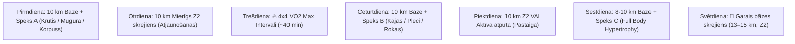

# Treniņu, Uztura un Hidratācijas Rekomendācijas & Nedēļas Programma

**Datums:** 2026. gada 9. septembris  
**Fokuss:** Rekompozīcija (*Tauku dedzināšana, muskuļu pieaugums +1.5 kg, VO2 Max celšana uz 52–55 ml/kg/min, Fitness Age 30 gadi*).

---

## 📊 1. Garmin Pēdējo Dienu Kaloriju & Slodzes Dati

| Datums | Kopējās kcal | Aktīvās kcal | BMR kcal | Soļi / Distance | Galvenās aktivitātes |
| :--- | :---: | :---: | :---: | :---: | :--- |
| **06.09.** (Sv.) | **3 846** | 1 793 | 2 053 | 34 505 (~31.3 km) | Skrējiens 14.36 km (1 075 kcal) |
| **07.09.** (P.) | **3 078** | 1 022 | 2 056 | 19 017 (~17.0 km) | Bāzes skrējiens 10.47 km (819 kcal) |
| **08.09.** (O.) | **3 705** | 1 656 | 2 049 | 21 011 (~18.9 km) | Skrējiens 10.30 km (803 kcal) + Spēks (551 kcal) |
| **09.09.** (T.) | *1 570* | *729* | *841* | *11 210 (~11.0 km)* | Rīta skrējiens 10.12 km (788 kcal) *(līdz 12:00)* |

* **3 pilno dienu vidējais patēriņš:** **~3 543 kcal / dienā** (no tām ~1 490 kcal aktīvās).

---

## 🥤 2. Zero Dzērieni (Coca-Cola Zero / Pepsi Zero)

### Zinātniskais un praktiskais vērtējums:
* **Kaloriju deficīts:** Satur 0 kcal, **neizjauc kaloriju deficītu** un neaptur tauku dedzināšanu (neizraisa insulīna lēcienu).
* **Drošība un saldinātāji:** PVO un EFSA noteiktā drošā dienas deva (ADI) aspartāmam ir 40–50 mg/kg (~4–5 litri dienā pie 81 kg svara). 1–2 glāzes vai viena bundža ir pilnīgi droša.
* **Riski, kam jāpievērš uzmanība:**
  1. **Zobu emalja:** Fosforskābe un citronskābe rada zemu pH (~2.5–3.0). Vēlams izdzert reizē ar ēdienu vai uzreiz, nevis malkot visas dienas garumā.
  2. **Kofeīns un miegs:** 2L pudele satur >200 mg kofeīna. Dzert tikai pirmajā dienas pusē (līdz 14:00–15:00).
  3. **Gremošana:** Gāzēts dzēriens + augsts šķiedrvielu daudzums uzturā (65g) var pastiprināt vēdera pūšanos.

---

## 💧 3. Ūdens & Elektrolītu Protokols

### A. Dienas ūdens norma: **2.5 līdz 3.5 litri tīra ūdens**
* **Kāpēc tik daudz:** 10–14 km ikdienas skrējieni, liels olbaltumvielu daudzums (220–250 g), augsts šķiedrvielu daudzums (60–65 g) un 10 g kreatīna prasa paaugstinātu šķidruma daudzumu nierēm un šūnām.

### B. Mājās gatavots elektrolītu dzēriens:
Kad stipri svīsti, **~90% no zaudētajiem minerāliem ir NĀTRIJS (sāls)**. Citronu sula (piem., *Limmi*) ir lieliska garšas, kālija un C vitamīna bāze, bet tai obligāti jāpievieno sāls:

```
🧪 Elektrolītu formula:
• 500–700 ml tīrs ūdens
• 1–2 ēdamkarotes Limmi citronu sulas (~15–25 ml)
• 1/4 tējkarotes sāls (~1.2–1.5 g sāls jeb ~500–600 mg nātrija)
• (Pēc izvēles) šķipsniņa magnija citrāta pulvera
```

### C. Dzeršana skrējiena laikā:
* **Līdz 60–70 minūtēm (10 km):** Skrējiena laikā dzert nav nepieciešams; padzerties nedaudz pirms starta un izdzert elektrolītus 30 minūšu laikā pēc finiša.
* **Virs 75 minūtēm (14+ km) vai karstumā:** Paņemt līdzi *soft flask* un dzert pa 1–2 malkiem (50–80 ml) ik pēc 15–20 min.

---

## 🏃‍♂️ 4. Rīta Skrējienu Grafiks & 4x4 VO2 Max Protokols

* **Starta laiks:** Parasti starp **07:50 un 08:25** (optimāls laiks pēc 7.5h miega).
* **Organisma gatavība:** Garmin *Training Readiness* **88/100 (High)**, statuss **`PRODUCTIVE`**, slodzes attiecība **Load Ratio 1.0 (Optimāla)**.

### 🔥 4x4 VO2 Max Intervālu Struktūra (1x nedēļā, Trešdienās):
Zinātniski efektīvākā metode VO2 Max celšanai no 46.5 uz 52–55 ml/kg/min.

[](https://www.youtube.com/results?search_query=4x4+interval+running+shorts)  
*▶️ Klikšķini uz attēla, lai atvērtu 4x4 protokola video.*

1. **Iesildīšanās (10–12 min):** Z2 bāzes temps (pulss ~115–125 bpm) + 2x15s uzrāvieni.
2. **4 x 4 minūtes darba intervāli:**
   * **4 min ĀTRI:** Pulss **145–156 bpm** (temps ap ~5:00–5:30 min/km, smaga elpošana). *Svarīgi: nesprintot pirmajā minūtē, bet uzturēt vienmērīgu jaudu!*
   * **3 min AKTĪVĀ ATPŪTA:** Ļoti lēns riksis vai soļi, kamēr pulss nokrītas < 125 bpm.
   * *Atkārto 4 reizes.*
3. **Atsildīšanās (5–8 min):** Viegliņš riksis (kopējais laiks ~40 min).

---

## 🗓️ 5. Pilna 7 Dienu Treniņu Programma (Skriešana + Spēks)



| Diena | Rīts (08:00) | Vakars / Pēcpusdiena | Mērķis |
| :--- | :--- | :--- | :--- |
| **Pirmdiena** | **10 km Bāzes skrējiens** *(Z2: 120–130 bpm)* | **Spēka treniņš A** *(~45 min)* | Aerobā bāze + Augšķermeņa spēks |
| **Otrdiena** | **10 km Mierīgs skrējiens** *(Z2)* | *Brīvs / Mobilitāte* | Zema stresa atjaunošanās |
| **Trešdiena** | **🔥 4x4 VO2 Max Intervāli** *(~40 min)* | *Brīvs* | Sirds trieciena tilpums un jauda |
| **Ceturtdiena** | **10 km Bāzes skrējiens** *(Z2)* | **Spēka treniņš B** *(~45 min)* | Bāze + Kājas & Pleci |
| **Piektdiena** | **10 km Z2** *vai 45 min pastaiga* | *Brīvs / Pirts / Atpūta* | Locītavu un saišu atslodze |
| **Sestdiena** | **8–10 km Viegls skrējiens** | **Spēka treniņš C** *(~45 min)* | Muskuļu hipertrofija (Pump) |
| **Svētdiena** | **🏃 Garais skrējiens (13–15 km)** *(Z2)* | *Pilnīga atpūta* | Izturības bāze un tauku oksidācija |

---

## 🏋️‍♂️ 6. Spēka Treniņu Kompleksi & Video Pamācības

### 🔴 Treniņš A: Augšķermenis & Korpuss (Pirmdiena)

#### 1. Pievilkšanās pie stieņa (Pull-ups) — 4 x 6–10
[](https://www.youtube.com/watch?v=sI91WJ-P41A)  
*▶️ [Skatīties pilno video pamācību](https://www.youtube.com/watch?v=sI91WJ-P41A) vai [YouTube Short (ātrais formāts)](https://www.youtube.com/results?search_query=pull+ups+proper+form+shorts)*

#### 2. Hanteļu spiešana guļus (Dumbbell Bench Press) — 4 x 8–12
[](https://www.youtube.com/watch?v=VmB1G1K7v94)  
*▶️ [Skatīties video pamācību](https://www.youtube.com/watch?v=VmB1G1K7v94) vai [YouTube Short](https://www.youtube.com/results?search_query=dumbbell+bench+press+proper+form+shorts)*

* **3. Hanteles vilkšana pie jostas vienai rokai (Single-Arm DB Row):** 3 x 10–12 ▶️ [Video pamācība (Short)](https://www.youtube.com/results?search_query=single+arm+dumbbell+row+proper+form+shorts)
* **4. Atspiešanās uz līdztekām (Dips) vai hanteļu spiešana šauri:** 3 x 10–12 ▶️ [Video pamācība (Short)](https://www.youtube.com/results?search_query=dips+proper+form+shorts)
* **5. Planks ar svara ripu (Weighted Plank):** 3 x 45–60 sek. ▶️ [Video pamācība (Short)](https://www.youtube.com/results?search_query=weighted+plank+form+shorts)

---

### 🔵 Treniņš B: Kājas, Pleci & Muguras lejasdaļa (Ceturtdiena)

#### 1. Bulgāru izklupieni ar hantelēm (Bulgarian Split Squat) — 3 x 8–10
[](https://www.youtube.com/watch?v=2C-uNgKwPLE)  
*▶️ [Skatīties Squat University pamācību](https://www.youtube.com/watch?v=2C-uNgKwPLE) vai [YouTube Short](https://www.youtube.com/results?search_query=bulgarian+split+squat+form+shorts)*

#### 2. Rumāņu vilkme ar hantelēm (Dumbbell RDL) — 4 x 10–12
[](https://www.youtube.com/watch?v=_oyxCn2iSjU)  
*▶️ [Skatīties RDL pamācību](https://www.youtube.com/watch?v=_oyxCn2iSjU) vai [YouTube Short](https://www.youtube.com/results?search_query=dumbbell+rdl+proper+form+shorts)*

* **3. Hanteļu spiešana stāvus virs galvas (Overhead Press):** 4 x 8–10 ▶️ [Video pamācība (Short)](https://www.youtube.com/results?search_query=dumbbell+overhead+press+form+shorts)
* **4. Hanteļu celšana sāņos (Lateral Raises):** 3 x 12–15 ▶️ [Video pamācība (Short)](https://www.youtube.com/results?search_query=dumbbell+lateral+raises+proper+form+shorts)
* **5. Kāju celšana karājoties pie stieņa (Hanging Leg Raises):** 3 x 10–15 ▶️ [Video pamācība (Short)](https://www.youtube.com/results?search_query=hanging+leg+raises+form+shorts)

---

### 🟢 Treniņš C: Full Body Hypertrophy (Sestdiena)

#### 1. Goblet Squat (Pietupieni ar hanteli pie krūtīm) — 3 x 12–15
[](https://www.youtube.com/watch?v=MeIiIdhvXT4)  
*▶️ [Skatīties Goblet Squat pamācību](https://www.youtube.com/watch?v=MeIiIdhvXT4) vai [YouTube Short](https://www.youtube.com/results?search_query=goblet+squat+proper+form+shorts)*

* **2. Hanteļu vilkšana pie krūtīm noliecies (Bent-over Row):** 3 x 10–12 ▶️ [Video pamācība (Short)](https://www.youtube.com/results?search_query=bent+over+dumbbell+row+proper+form+shorts)
* **3. Slīpā hanteļu spiešana (Incline Press):** 3 x 10–12 ▶️ [Video pamācība (Short)](https://www.youtube.com/results?search_query=incline+dumbbell+press+form+shorts)
* **4. Bicepsa + Tricepsa supersets:**  
  * Hanteļu locīšana bicepsam (3 x 12) ▶️ [Bicep Curl Short](https://www.youtube.com/results?search_query=dumbbell+bicep+curl+form+shorts)  
  * Franču prese ar hanteli aiz galvas (3 x 12) ▶️ [Tricep Extension Short](https://www.youtube.com/results?search_query=overhead+dumbbell+tricep+extension+form+shorts)
* **5. Farmer's Walk (Smagu hanteļu nešana):** 3 x 40–50 metri ▶️ [Video pamācība (Short)](https://www.youtube.com/results?search_query=farmers+walk+proper+form+shorts)

---

## 🌙 7. Vakara Treniņu (plkst. 20:00) Ietekme uz Miegu

* **Garmin 08.09. dati pēc 20:45 treniņa:** Sleep Score **89/100**, dziļais miegs **24% (1h 46m)**, nakts stress **15**.
* **Secinājums:** Spēka treniņš plkst. 20:00 ar zemu vidējo pulsu (~116 bpm) **nekaitē miegam**, ja starp treniņa beigām un gulētiešanu (ap 23:30) ir **1.5–2 stundu logs**.
* **Optimālākais laiks:** Ja iespējams — **18:30–19:30**, bet 20:00 ir pilnīgi pieņemams.
