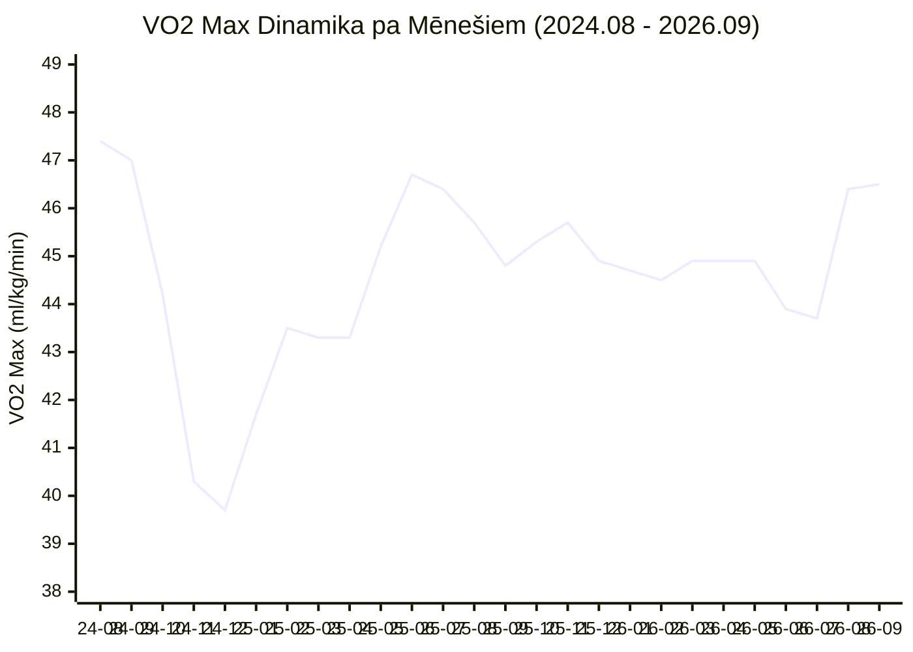

# 🫀 Garmin Pilnā VO2 Max Vēsture un Grafiks (2024–2026)

> **Pārskata periods:** 2024. gada 6. augusts — 2026. gada 11. septembris  
> **Kopējais datu apjoms:** 777 dienas / mērījumi  
> **Avots:** Garmin FirstBeat Analytics API (skriešanas un aerobās aktivitātes)

---

## 📊 Kopsavilkums un Galvenie Rādītāji

| Rādītājs | Vērtība | Datums / Periods | Komentārs |
| :--- | :---: | :---: | :--- |
| 📍 **Pašreizējais līmenis** | **46.5** ml/kg/min *(profilā 47.0)* | 2026-09-11 | Spēcīgs un stabils pieaugums |
| 🚀 **Vēsturiskais pīķis** | **47.4** ml/kg/min | 2024-08-10 — 2024-09-01 | Sākotnējais maksimālais līmenis |
| 📉 **Vēsturiskais minimums** | **39.3** ml/kg/min | 2024-12-22 — 2024-12-27 | Ziemas sezonas kritums |
| 📈 **Pēdējo 2 mēnešu lēciens** | **+2.8** ml/kg/min | 2026-07-28 līdz 2026-09-11 | No 43.7 uz 46.5 (intensīvs progress) |
| 🎯 **Mērķis (Fitness Age 30)** | **52.0 – 55.0** ml/kg/min | 2026./2027. gads | Sasniedzams ar 4x4 intervāliem un optimālu svaru |

---

## 📈 Vizuālais Grafiks (Mermaid Diagramma)



---

## 📉 ASCII Trajektorijas Līknes Vizualizācija

```text
VO2 Max (ml/kg/min)
 48 ┤                                                                
 47 ┤ █▀▀▀▄                                                ▄▄   ██ (46.5 Šodien)
 46 ┤      ▀▄                                  ▄▄▄▄       █  ▀▄█ 
 45 ┤        ▀▄                           ▄▄▄▀█    ▀▄▄▄▄▄▀       
 44 ┤          █▄          ▄▄▄█▄▄▄▄▄▄▄▄▄▄▀                       
 43 ┤            ▀▄      ▄▀                                      
 42 ┤              █    █                                        
 41 ┤               █  █                                         
 40 ┤                ██                                          
 39 ┤                ▀ (39.3 Min, Dec 2024)                      
    └────────────────────────────────────────────────────────────
      2024-08    2024-12    2025-06    2025-12    2026-07 2026-09
```

---

## 🔍 VO2 Max Dinamikas Galvenie Posmi

### 1. 2024. gada rudens / ziema: Sākotnējais līmenis un kritums (47.4 → 39.3)
* **2024. gada augusts:** Garmin sāk fiksēt VO2 Max ar augstu bāzes rādītāju **47.4**.
* **2024. gada oktobris–decembris:** Iestājoties rudenim un ziemai, samazinoties āra skriešanas apjomam un intensitātei, VO2 Max piedzīvoja būtisku lejupslīdi līdz vēsturiskajam minimumam **39.3** decembra beigās.

### 2. 2025. gada pavasaris / vasara: Lielais atspēriens (39.3 → 46.8)
* **2025. gada janvāris–jūlijs:** Sezonai atsākoties, novērojams izcils, ilgstošs progress 7 mēnešu garumā (+7.5 vienības), sasniedzot **46.8** 2025. gada jūlijā.

### 3. 2025. gada rudens — 2026. gada pavasaris: Noturēšanās plato (44.5 — 45.7)
* Rudens un ziemas periodā fiziskā forma saglabājās ievērojami labāka nekā gadu iepriekš. VO2 Max nenokrita zem 44.4, veidojot stabilu aerobās izturības plato (~44.9).

### 4. 2026. gada jūlijs — septembris: Jauns straujš izrāviens (43.7 → 46.5)
* Pēc īslaicīga krituma jūlijā (43.7), augustā un septembrī sekoja ļoti straujš un spēcīgs kāpums līdz **46.5** (+2.8 ml/kg/min dažu nedēļu laikā, Garmin noapaļotais profils: **47.0**).
* To nodrošināja regulāri gari skrējieni (14+ km), augstāka slodzes kapacitāte un svara samazināšanās tendence.

---

## 📅 Pilna Mēnešu Datu Tabula

| Mēnesis | Mēneša beigās | Mēneša Min | Mēneša Max | Vidējais | Mēneša izmaiņa |
| :---: | :---: | :---: | :---: | :---: | :---: |
| `2024-08` | **47.4** | 46.7 | 47.4 | 47.3 | - |
| `2024-09` | **47.0** | 47.0 | 47.4 | 47.1 | -0.4 |
| `2024-10` | **44.2** | 44.1 | 47.0 | 44.9 | -2.8 |
| `2024-11` | **40.3** | 40.3 | 44.2 | 43.6 | -3.9 |
| `2024-12` | **39.7** | 39.3 | 39.9 | 39.7 | -0.6 |
| `2025-01` | **41.7** | 39.7 | 41.7 | 40.5 | +2.0 |
| `2025-02` | **43.5** | 41.7 | 43.5 | 42.9 | +1.8 |
| `2025-03` | **43.3** | 43.3 | 44.1 | 43.9 | -0.2 |
| `2025-04` | **43.3** | 42.4 | 43.3 | 42.8 | 0.0 |
| `2025-05` | **45.2** | 43.3 | 45.2 | 44.2 | +1.9 |
| `2025-06` | **46.7** | 45.2 | 46.7 | 46.1 | +1.5 |
| `2025-07` | **46.4** | 46.2 | 46.8 | 46.5 | -0.3 |
| `2025-08` | **45.7** | 45.7 | 46.4 | 46.2 | -0.7 |
| `2025-09` | **44.8** | 44.7 | 45.7 | 45.2 | -0.9 |
| `2025-10` | **45.3** | 44.8 | 45.3 | 45.1 | +0.5 |
| `2025-11` | **45.7** | 45.3 | 45.7 | 45.5 | +0.4 |
| `2025-12` | **44.9** | 44.9 | 45.7 | 45.3 | -0.8 |
| `2026-01` | **44.7** | 44.7 | 44.9 | 44.8 | -0.2 |
| `2026-02` | **44.5** | 44.5 | 45.0 | 44.7 | -0.2 |
| `2026-03` | **44.9** | 44.4 | 44.9 | 44.7 | +0.4 |
| `2026-04` | **44.9** | 44.9 | 44.9 | 44.9 | 0.0 |
| `2026-05` | **44.9** | 44.9 | 44.9 | 44.9 | 0.0 |
| `2026-06` | **43.9** | 43.9 | 44.9 | 44.4 | -1.0 |
| `2026-07` | **43.7** | 43.7 | 44.2 | 43.9 | -0.2 |
| `2026-08` | **46.4** | 43.7 | 46.4 | 45.5 | **+2.7** |
| `2026-09` | **46.5** | 46.4 | 46.5 | 46.4 | **+0.1** |

---

## 🎯 Kā sasniegt 50.0 – 55.0 ml/kg/min (Nākamais līmenis)?

1. **4x4 minūšu intervālu treniņi (Norvēģu protokols):**
   * 1 reizi nedēļā 4x4 minūtes pie 90–95% HRmax (165–175 bpm) ar 3 min atpūtu. Šis ir zinātniski pierādīts visefektīvākais rīks sirds tilpuma un VO2 Max celšanai.
2. **Ķermeņa kompozīcijas uzlabošana (Svara samazināšana uz tauku rēķina):**
   * VO2 Max formula ir `ml O2 / kg / min`. Samazinot lieko tauku masu par 2–3 kg, matemātiski VO2 Max uzreiz pieaug par ~1.5–2.0 punktiem pat bez fiziskās sagatavotības izmaiņām.
3. **Zone 2 bāzes apjoma uzturēšana:**
   * 1 garš skrējiens nedēļā (12–15 km) pie 125–138 bpm sagatavo mitohondrijus un kapilāru tīklu augstas intensitātes skābekļa transportam.
