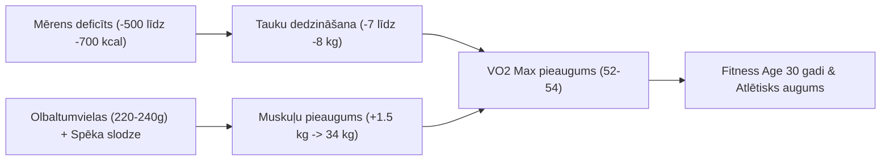

# Veselības, Uztura un Fitnesa Kopsavilkums & Tendences

**Periods:** 2026. gada septembris (pabeigtās dienas)  
**Mērķis:** Fizioloģiskais fitnesa vecums 30 gadi — **Ķermeņa Rekompozīcija** (*VO2 Max 52–55 ml/kg/min, svars 75–76 kg, tauku saturs 13–15%, **palielinot muskuļu masu līdz 33.5–34.0 kg** (+1.1 līdz 1.6 kg tīru muskuļu)*).

---

## 📊 1. Pabeigto dienu kopsavilkuma bilance

| Datums | Uzņemtās kcal | Patērētās kcal (Garmin) | Enerģijas bilance (Deficīts) | Olbalt. (g) | Šķiedrv. (g) | Skrējiens (km) | Citas aktivitātes | Miegs (Score / h) | RHR (bpm) | Svars (kg) |
| :--- | :--- | :--- | :--- | :--- | :--- | :--- | :--- | :--- | :--- | :--- | :--- |
| **07.09.2026** | 2 594 | 3 078 | **-484 kcal** | 231.3 | 61.2 | 10.47 km | — | 89 (Lielisks) / 7.3h | 49 | 82.29 |
| **08.09.2026** | 2 788 | 3 705 | **-917 kcal** | 249.9 | 65.1 | 10.30 km | Spēka treniņš (1h 06m) | 89 (Lielisks) / 7.6h | 50 | 81.72 |
| **Vidēji dienā**| **~2 691** | **~3 392** | **-701 kcal** | **240.6** | **63.2** | **10.39 km** | **1 spēka treniņš** | **89 / 7.5h** | **49.5** | **82.01** |

---

## 🔍 2. Galvenās tendences un Rekompozīcijas Mehānisms

### A. Ķermeņa rekompozīcija (Tauku dedzināšana + Muskuļu audzēšana vienlaikus):
* **Kāpēc tas strādā:** Pie pašreizējiem 25.6% ķermeņa tauku (~21 kg tauku masa) organismam ir milzīga iekšējā enerģijas rezerve. Deficīta apstākļos tauki tiek tērēti kā degviela, savukārt augstais aminoskābju daudzums no uztura (220–240 g), kreatīns (10 g) un spēka treniņi dod anabolisku impulsu **muskuļu masas palielināšanai par +1 līdz +1.5 kg**.
* **Tauku dedzināšanas temps:** ~700 kcal deficīts dienā nodrošina **~0.6–0.7 kg tīru tauku zudumu nedēļā** (~2.5 kg mēnesī).

### B. Muskuļu masas audzēšanas un aizsardzības faktori:
* **Olbaltumvielas:** ~220–240 g dienā (~2.7–3.0 g/kg) nodrošina maksimālu muskuļu proteīnu sintēzi (MPS).
* **Kreatīna monohidrāts (10 g):** Veicina ATP atjaunošanos, muskuļu spēku un šūnu anabolismu.
* **Regulāri spēka treniņi (2–3x nedēļā):** Dod muskuļiem signālu augt un stiprināties.

### C. Atjaunošanās un sirds-asinsvadu sistēma:
* **Miega kvalitāte (Sleep Score 89/100, 7.5 h):** Izcils rādītājs. Dziļajā miegā izdalās augšanas hormons, kas nepieciešams muskuļu hipertrofijai.
* **Miera pulss (RHR 49–50 bpm):** Zems un stabils, apliecina izcilu atjaunošanos un aerobo veselību.
* **Dienas stresa līmenis (21–22):** Ļoti zems, dominē atpūtas stāvoklis (Parasympathetic tone).

---

## 🎯 3. Virzība uz "Fitness Age 30 gadi" — Jaunais Rekompozīcijas Mērķis

| Parametrs | Bāzes stāvoklis (07.09) | Pašreizējais progress | **Mērķis (30-gadīgs atlēts)** | Nepieciešamās izmaiņas |
| :--- | :--- | :--- | :--- | :--- |
| **Svars** | 82.29 kg | 81.72 kg | **75.0 – 76.0 kg** | -6.5 līdz -7.0 kg |
| **Ķermeņa tauki %** | 25.6% (~21 kg) | 25.9% | **13.0% – 14.5% (~10 kg)** | **-11 kg tauku masas** 🔥 |
| **Skeleta muskuļu masa** | 32.42 kg | 32.28 kg | **33.5 – 34.0 kg** | **+1.1 līdz +1.6 kg tīru muskuļu** 🚀 |
| **SMI (Muskuļu indekss)** | 10.58 kg/m² | 10.54 kg/m² | **> 11.0 kg/m²** | Top līmeņa muskuļu attīstība |
| **VO2 Max** | 46.4 ml/kg/min | 46.4 ml/kg/min | **52.0 – 55.0 ml/kg/min** | +6.0 – 8.5 ml/kg/min |
| **Skriešanas temps (bāzes)** | ~6:45 min/km | ~6:38 min/km | **< 5:30 min/km** | -1 min/km pie tā paša Z2 pulsa |

---

### ⏱️ Izpildes laika grafiks un prognoze:

1. **Rekompozīcijas laika grafiks (~10–12 nedēļas, līdz novembra beigām):**
   * Tiek nodedzināti **~8 kg tauku** un vienlaikus uzaudzēti **~1.5 kg muskuļu**, nonākot pie svara **~75.5 kg** un tauku satura **~13.5%**.
2. **VO2 Max lēciens (46.4 ➔ 53–55 ml/kg/min):**
   * Lielāka muskuļu jauda un vieglāks ķermeņa svars ievērojami palielina skābekļa patēriņa efektivitāti, padarot skriešanu vieglu un ātru.

---

## 🚀 Rīcības plāns:
1. **Spēka treniņi 2–3x nedēļā:** Iekļaut progresīvu pārslodzi pamata vingrinājumos (pievilkšanās, atspiešanās ar svaru, pietupieni, hanteles).
2. **Uzturs ar 220–240 g proteīna:** Kā koriģētajā 09.09 plānā (500 g vistas fileja, lēcas/griķi, olas, sēklas, dārzeņi).
3. **Mērens deficīts (-500 līdz -700 kcal):** Saglabāt kontrolētu deficītu, nekrītot pārlieku lielā bada stāvoklī.
4. **1x nedēļā 4x4 min VO2 Max intervāli:** Sirds maksimālās jaudas stimulēšanai.
