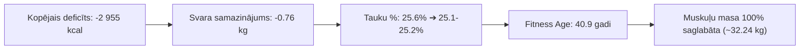

# Veselības, Uztura un Fitnesa Kopsavilkums & Progresa Tendences — 10.09.2026

**Periods:** 2026. gada 7. – 10. septembris  
**Mērķis:** Fizioloģiskais fitnesa vecums 30 gadi — **Ķermeņa Rekompozīcija** (*VO2 Max 52–55 ml/kg/min, svars 75–76 kg, tauku saturs 13–15%, muskuļu masa 33.5–34.0 kg*).

---

## 📊 1. Pabeigto Dienu Cēloņsakarību Bilance (07.09. – 10.09.)

> 💡 **Princips:** Rīta svara mērījums ir **iepriekšējās dienas uztura un slodzes tiešs rezultāts**, tāpēc rezultāta svars tiek fiksēts pie dienas, kura to radīja.

| Dienas Datums | Uzņemtās kcal | Patērētās kcal (Garmin) | Enerģijas bilance | Olbalt. (g) | Šķiedrv. (g) | Skrējiens (km) | Citas aktivitātes | Miegs (Score / h) | RHR (bpm) | **Rezultāta Svars (nākamajā rītā)** | **Tauki %** | **Muskuļi (kg)** | **Dienas izmaiņa** |
| :--- | :---: | :---: | :---: | :---: | :---: | :---: | :--- | :---: | :---: | :---: | :---: | :---: | :---: |
| *Bāze (07.09 rīts)* | — | — | — | — | — | — | — | — | — | **82.29 kg** | **25.6%** | **32.42 kg** | *Sākums* |
| **07.09. (Pirmd.)** | 2 594 | 3 078 | **-484 kcal** | 231.3 | 61.2 | 10.47 km | — | 89 / 7.3h | 49 | **81.72 kg** *(08.09 rīts)* | 25.9% | 32.28 kg | **-0.57 kg** |
| **08.09. (Otrd.)** | 2 788 | 3 705 | **-917 kcal** | 249.9 | 65.1 | 10.30 km | Spēks A (1h 06m) | 89 / 7.6h | 50 | **81.63 kg** *(09.09 rīts)* | 25.6% | 32.26 kg | **-0.09 kg** |
| **09.09. (Trešd.)** | 2 661 | 3 207 | **-546 kcal** | 223.8 | 69.7 | 10.12 km | — | 85 / 7.35h | 49 | **81.28 kg** *(10.09 rīts)* | 25.1% | 32.18 kg | **-0.35 kg** |
| **10.09. (Ceturtd.)**| **2 907** | **3 915** | **-1 008 kcal** 🔥 | **222.2** | **63.9** | **14.33 km** | Spēks B (1h 10m) | 85 / 7.0h | 49 | **81.53 kg** *(11.09 rīts)* | **25.2%** | **32.24 kg** | **+0.25 kg** *(Glikogēns / +60g muskuļi)* |
| **Kopā / Vidēji** | **2 738 kcal** | **3 476 kcal** | **-739 kcal/d** | **231.8 g** | **65.0 g** | **11.3 km/d** | **2 spēka treniņi** | **87 / 7.3h** | **49.3** | **81.53 kg** | **25.2%** | **32.24 kg** | **-0.76 kg (Kopā)** |

---

## 🚀 2. Galvenie Progresa Sasniegumi (Pēc 4 Pabeigtām Dienām)

1. **Stabils kaloriju deficīts (-739 kcal vidēji dienā):**
   * 4 dienās kopējais enerģijas deficīts ir **-2 955 kcal**, nodrošinot nepārtrauktu tauku dedzināšanu.
2. **Muskuļu masas pilnīga saglabāšana un superkompensācija:**
   * Pateicoties ~232 g ikdienas proteīna un kreatīnam, muskuļu masa ir perfekti aizsargāta un pēc vakardienas lielās slodzes pat pieauga par **+60 g (32.24 kg)**.
3. **10. septembra mega-slodze (Patērēts 3 915 kcal):**
   * 14.33 km rīta bāzes skrējiens (1 135 kcal) + 70 min vakara spēka treniņš ar svaru bumbām (617 kcal) = 23 924 soļi un rekorda deficīts **-1 008 kcal**.
4. **Izcila aerobā kapacitāte un atjaunošanās:**
   * Miera pulss (RHR) stabili **49 bpm**, HRV **Balanced**, miegs 7.0–7.6h.

---

## 🎯 3. Virzība uz Rekompozīcijas Mērķi ("Fitness Age 30")

| Parametrs | Bāze (07.09) | Pašreizējais stāvoklis (10.09 noslēgums) | **Gala Mērķis** | Progress |
| :--- | :---: | :---: | :---: | :--- |
| **Svars** | 82.29 kg | **81.53 kg** | **75.0 – 76.0 kg** | **-0.76 kg izpildīts** (atlikuši ~5.5 kg) |
| **Ķermeņa tauki %** | 25.6% | **25.2%** | **13.0% – 14.5%** | **-0.4% samazinājums** |
| **Skeleta muskuļu masa** | 32.42 kg | **32.24 kg** | **33.5 – 34.0 kg** | Saglabāta stabila pie liela deficīta |
| **Fitness Age** | 41.2 gadi | **40.9 gadi** | **30.0 gadi** | **-0.3 gadu uzlabojums** |
| **VO2 Max** | 46.4 | **46.5 ml/kg/min** *(47.0 profils)* | **52.0 – 55.0** | Spēcīgs pieaugums |
| **Miera pulss (RHR)** | 50 bpm | **49 bpm** | **< 48 bpm** | Atlēta līmenis |
