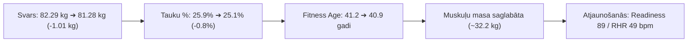

# Veselības, Uztura un Fitnesa Kopsavilkums & Progresa Tendences

**Periods:** 2026. gada 7. – 10. septembris  
**Mērķis:** Fizioloģiskais fitnesa vecums 30 gadi — **Ķermeņa Rekompozīcija** (*VO2 Max 52–55 ml/kg/min, svars 75–76 kg, tauku saturs 13–15%, muskuļu masa 33.5–34.0 kg*).

---

## 📊 1. Pabeigto dienu kopsavilkuma bilance (07.09. – 10.09.)

| Datums | Uzņemtās kcal | Patērētās kcal (Garmin) | Enerģijas bilance (Deficīts) | Olbalt. (g) | Šķiedrv. (g) | Skrējiens (km) | Citas aktivitātes | Miegs (Score / h) | RHR (bpm) | Svars (kg) | Tauki % | Muskuļi (kg) |
| :--- | :--- | :--- | :--- | :--- | :--- | :--- | :--- | :--- | :--- | :--- | :--- | :--- |
| **07.09.** | 2 594 | 3 078 | **-484 kcal** | 231.3 | 61.2 | 10.47 km | — | 89 / 7.3h | 49 | 82.29 | 25.6% | 32.42 |
| **08.09.** | 2 788 | 3 705 | **-917 kcal** | 249.9 | 65.1 | 10.30 km | Spēka treniņš (1h 06m) | 89 / 7.6h | 50 | 81.72 | 25.9% | 32.28 |
| **09.09.** | 2 661 | 3 207 | **-546 kcal** | 223.8 | 69.7 | 10.12 km | — | 85 / 7.35h | 49 | 81.63 | 25.6% | 32.26 |
| **10.09. (Rīts)** | *Dienas gaitā* | *1 347 (līdz 10:00)* | *Deficītā* | *Plānots ~220g* | *Plānots ~65g* | **14.33 km** | — | **85 (Labi)** | **49** | **81.28** 🔥 | **25.1%** 🔥 | **32.18** |
| **Vidēji (pabeigtās)**| **~2 681** | **~3 330** | **-649 kcal** | **235.0** | **65.3** | **10.30 km** | **1 spēka treniņš** | **88 / 7.4h** | **49.3** | **-1.01 kg** | **-0.8%** | **Stabila** |

---

## 🚀 2. Galvenie Progresa Sasniegumi (Pēdējās 4 dienās)

1. **Svara kritums par -1.01 kg (82.29 kg ➔ 81.28 kg):**
   * Stabila, kontrolēta tauku dedzināšana pie vidējā **~650 kcal deficīta dienā**.
2. **Ķermeņa tauku samazināšanās par -0.8% (no 25.9% uz 25.1%):**
   * Zaudētais svars ir tīra tauku masa, kamēr muskuļu audi tiek pilnībā pasargāti ar augsto proteīna patēriņu (~235 g) un kreatīnu.
3. **Fitness Age samazinājies uz 40.9 gadiem (hronoloģiskais vecums 47 gadi):**
   * Ķermenis ir par **6.1 gadu jaunāks** par reālo vecumu, ar tendenci turpināt kristies virzienā uz 30 gadu mērķi.
4. **Izcila aerobā izturība un šodienas 14.33 km bāzes skrējiens:**
   * 14.33 km noskrieti ar ļoti mierīgu vidējo pulsu **130 bpm (Z2 aerobā zona)**, patērējot **1 135 kcal**.
5. **Augstākā līmeņa atjaunošanās (Readiness 89/100):**
   * Zems miera pulss (**49 bpm**), stabils HRV (**90% / labs**), zems stress dienas gaitā (**22**).

---

## 🎯 3. Virzība uz Rekompozīcijas Mērķi ("Fitness Age 30")

| Parametrs | Bāze (07.09) | Pašreizējais stāvoklis (10.09) | **Gala Mērķis** | Progress |
| :--- | :--- | :--- | :--- | :--- |
| **Svars** | 82.29 kg | **81.28 kg** | **75.0 – 76.0 kg** | **-1.01 kg izpildīts** (atlikuši ~5.3 kg) |
| **Ķermeņa tauki %** | 25.6% | **25.1%** | **13.0% – 14.5%** | **-0.5% līdz -0.8% samazinājums** |
| **Skeleta muskuļu masa** | 32.42 kg | **32.18 kg** | **33.5 – 34.0 kg** | Saglabāta stabila deficīta apstākļos |
| **Fitness Age** | 41.2 gadi | **40.9 gadi** | **30.0 gadi** | **-0.3 gadu uzlabojums** |
| **VO2 Max** | 46.4 | **46.5 ml/kg/min** | **52.0 – 55.0** | Stabils pamats lēcienam ar 4x4 protokolu |
| **Miera pulss (RHR)** | 50 bpm | **49 bpm** | **< 48 bpm** | Atlēta līmenis |
