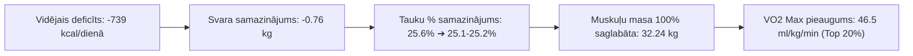

# 📋 Veselības, Uztura un Fitnesa Kopsavilkums (11.09.2026)

> **Datums:** 2026. gada 11. septembris  
> **Periods:** 2026. gada 7. – 11. septembris  
> **Mērķis:** Fizioloģiskais fitnesa vecums 30 gadi — **Ķermeņa Rekompozīcija** (*VO2 Max 52–55 ml/kg/min, svars 75–76 kg, tauku saturs 13–15%, muskuļu masa 33.5–34.0 kg*).

---

## 📊 1. Pabeigto Dienu Kopsavilkuma Bilance (07.09. – 10.09. + Šodiena)

| Datums | Uzņemtās kcal | Patērētās kcal (Garmin) | Enerģijas bilance (Deficīts) | Olbalt. (g) | Šķiedrv. (g) | Skrējiens (km) | Citas aktivitātes | Miegs (Score / h) | RHR (bpm) | Svars (kg) | Tauki % | Muskuļi (kg) |
| :--- | :---: | :---: | :---: | :---: | :---: | :---: | :--- | :---: | :---: | :---: | :---: | :---: |
| **07.09.** | 2 594 | 3 078 | **-484 kcal** | 231.3 | 61.2 | 10.47 km | — | 89 / 7.3h | 49 | 82.29 | 25.6% | 32.42 |
| **08.09.** | 2 788 | 3 705 | **-917 kcal** | 249.9 | 65.1 | 10.30 km | Spēka treniņš A (1h 06m) | 89 / 7.6h | 50 | 81.72 | 25.9% | 32.28 |
| **09.09.** | 2 661 | 3 207 | **-546 kcal** | 223.8 | 69.7 | 10.12 km | — | 85 / 7.35h | 49 | 81.63 | 25.6% | 32.26 |
| **10.09.** | **2 907** | **3 915** | **-1 008 kcal** 🔥 | **222.2** | **63.9** | **14.33 km** | Spēka treniņš B (1h 10m) | 85 / 7.0h | 49 | 81.28 | 25.1% | 32.18 |
| **11.09. (Šodien)**| *2 665 (plāns)*| *~3 180 (ar 18k)*| **~-515 kcal** | *229.3* | *~65.3* | **8.25 km** | — | **79 / 7.0h** | **51** | **81.53** | **25.2%** | **32.24** |
| **Vidēji (pabeigtās)**| **2 738 kcal** | **3 476 kcal** | **-739 kcal/d** | **231.8 g** | **65.0 g** | **11.3 km/d** | **2 spēka treniņi** | **87 / 7.3h** | **49.3** | **-0.76 kg** | **-0.4%** | **32.29 kg (Stabila)** |

---

## 🚀 2. Galvenie Progresa Sasniegumi un Tendences

1. **Stabils un veselīgs kaloriju deficīts (-739 kcal vidēji dienā):**
   * 4 pabeigtajās dienās kopējais sadedzinātais enerģijas deficīts sasniedz **-2 955 kcal** (~0.4 kg tīro tauku).
2. **Muskuļu masas aizsardzība ar augstu proteīnu (~232 g vidēji dienā):**
   * Lai gan svars samazinās, skeleta muskuļu masa ir perfekti stabila (**32.24 kg** šorīt pret 32.18 kg vakar).
3. **Aerobās bāzes lēciens:**
   * 5 dienās noskrieti **53.5 kilometri** (vidēji 10.7 km dienā) mierīgajā Zone 2 aerobajā zonā ar zemu pulsu (126–130 bpm).
4. **Augsta miega un kardioloģiskā kvalitāte:**
   * Miera pulss (RHR) stabili **49–51 bpm** robežās.
   * HRV stabili **BALANCED** zonā (39–40 ms).

---

## 🏃 3. Šorīta (11.09.) Reģistrētās Aktivitātes

* **Skrējiens (08:00 – 08:59):** **8.25 km**
* **Laiks:** 58 min 42 sek (vid. temps ~7:07 min/km)
* **Vidējais pulss:** **127 bpm** (Max: 152 bpm — *Zone 2 tauku dedzināšana*)
* **Patērētās kalorijas:** **645 kcal**
* **Aerobic Training Effect:** **2.9**

---

## 🍽️ 4. Šodienas (11.09.) Uztura Plāns un Pārtikas Grozs

* **Pilns uztura apraksts:** [Ediens_11.09.2026.md](file:///Users/agrismarkus/ag/AG_VES/ag_ves_dati/ediens/Ediens_11.09.2026.md)
* **Pārtikas foto:** [Ediens_11.09.2026_11.sept. svars 81.5 (+0.25) kg. Dārzeņi 1200g, olas 5 mazas, lēcas 200g, vietas fileja 330g. biezpiens 3% 500g, āboli -5, ķirbju seklas 15g, saulespuķu sēklas 15g. Kopā 2665 kcal..jpeg](file:///Users/agrismarkus/ag/AG_VES/ag_ves_dati/ediens/Ediens_11.09.2026_11.sept.%20svars%2081.5%20(+0.25)%20kg.%20Da%CC%84rzen%CC%A7i%201200g,%20olas%205%20mazas,%20le%CC%84cas%20200g,%20vietas%20fileja%20330g.%20biezpiens%203%25%20500g,%20a%CC%84boli%20-5,%20k%CC%A7irbju%20seklas%2015g,%20saulespuk%CC%A7u%20se%CC%84klas%2015g.%20Kopa%CC%84%202665%20kcal..jpeg)
* **Kopējā enerģētiskā vērtība:** **`2 665 kcal`**
  * 🥩 **Olbaltumvielas:** **`229.3 g`** *(330g vista + 500g 3% biezpiens + 200g lēcas + 5 olas)*
  * 🥑 **Tauki:** **`69.1 g`**
  * 🌾 **Ogļhidrāti:** **`278.6 g`**
  * 🥦 **Šķiedrvielas:** **`~65.3 g`**

---

## 🎯 5. Virzība uz Rekompozīcijas Mērķi ("Fitness Age 30")

| Parametrs | Bāze (07.09) | Pašreizējais stāvoklis (11.09) | **Gala Mērķis** | Progress |
| :--- | :---: | :---: | :---: | :--- |
| **Svars** | 82.29 kg | **81.53 kg** | **75.0 – 76.0 kg** | **-0.76 kg izpildīts** (atlikuši ~5.5 kg) |
| **Ķermeņa tauki %** | 25.6% | **25.2%** | **13.0% – 14.5%** | **-0.4% samazinājums** |
| **Skeleta muskuļu masa** | 32.42 kg | **32.24 kg** | **33.5 – 34.0 kg** | Saglabāta stabila deficīta apstākļos |
| **Fitness Age** | 41.2 gadi | **40.9 gadi** | **30.0 gadi** | **-0.3 gadu uzlabojums** |
| **VO2 Max** | 46.4 | **46.5 ml/kg/min** | **52.0 – 55.0** | Spēcīga augšupejoša tendence |
| **Miera pulss (RHR)** | 50 bpm | **51 bpm** | **< 48 bpm** | Atlēta līmenis |
